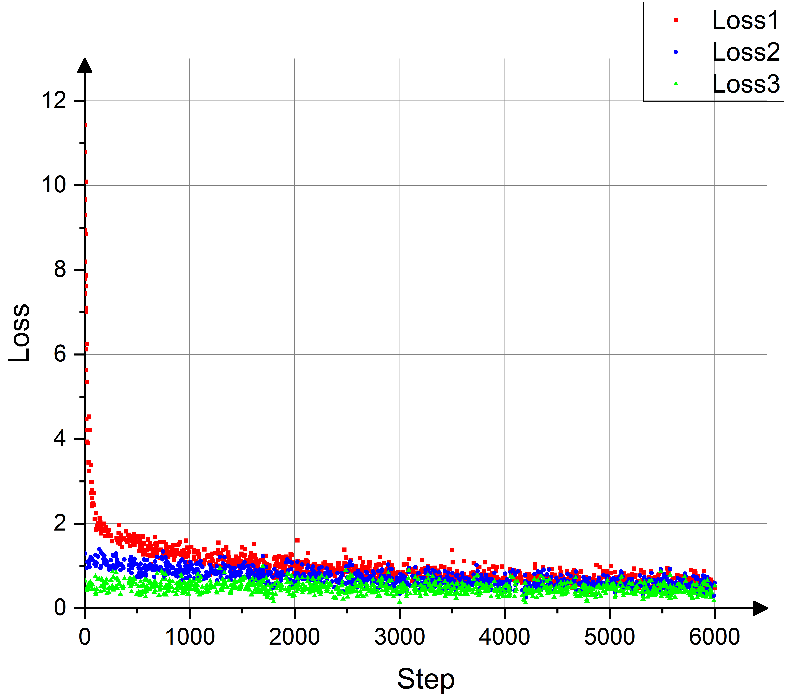
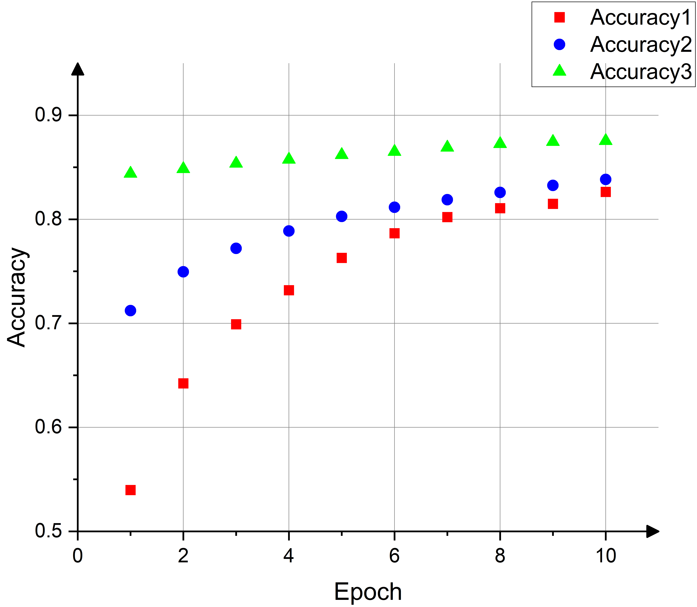
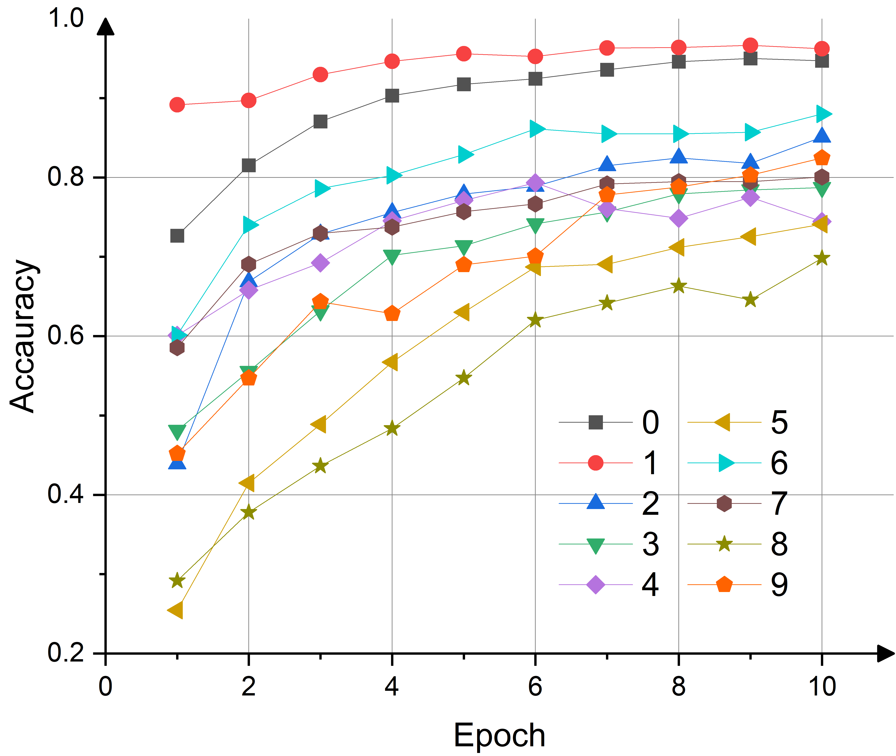

# **MNIST Handwritten Digit Recognition**

This is a major assignment for the **ZJU course "Frontiers in Artificial Intelligence"**. The project has provided a partial implementation of the base **LeNet-5 network**, and requires further completion of **convolution**, **pooling**, and other key operations. The implementation must use **NumPy** to code the **forward propagation** and **backward propagation algorithms**, **without relying on deep learning frameworks like PyTorch**. Subsequent work may involve exploring more advanced network architectures to improve recognition accuracy.

**Note**: This report has been condensed for clarity. Full code and detailed logs are available in the repository.

## **Project Overview**

Implemented **LeNet-5** from scratch using **NumPy** to perform MNIST handwritten digit recognition, including forward/backward propagation for convolutional, pooling, and fully connected layers. Key tasks:

* Built core components: `Conv2d`, `MaxPool2d`, `Linear`, and activation functions (`ReLU`, `Sigmoid`, `Tanh`).
* Trained the model using **SGD** with manual gradient computation (no deep learning frameworks).
* Achieved **~88% test accuracy** after iterative optimization.
* Explored advanced architectures (e.g., ResNet-50) using PyTorch for comparison.

## **Key Technical Components**

### **Core Modules**

1. **Convolutional Layer (`Conv2d`)**
   * Forward pass: Sliding window with stride/padding.
   * Backward pass: Gradient computation for weights, biases, and input.
2. **Pooling Layers (`MaxPool2d`, `AvgPool2d`)**
   * Downsampling with gradient redistribution during backpropagation.
3. **Activation Functions**
   * Implemented `ReLU`, `Sigmoid`, and `Tanh` with derivative-based backward passes.
4. **Cross-Entropy Loss**
   * Softmax integration for multi-class classification.

### **Training Pipeline**

* Data preprocessing: Normalization, reshaping (28×28 → 1×28×28).
* Mini-batch SGD with learning rate `lr=0.01`.
* Training monitoring via `tensorboard` for loss/accuracy visualization.

## **Challenges & Solutions**

### **1. Path Configuration Challenges**

* **Issue** : File loading errors due to relative path inconsistencies.
* **Fix** : Switched to absolute paths for dataset loading.

### **2. Dimension Mismatch in Model Parameters**

* **Issue** : Matrix size mismatches during forward propagation.
* **Debugging** : Analyzed layer dimensions step-by-step with GPT guidance.

### **3. Slow Training Speed**

* **Issue** : Each epoch took **2–3 hours** (pure NumPy implementation).
* **Optimization** : Introduced batch training and progress tracking with `tqdm`.

### **4. Limited Accuracy (~88%)**

* **Root Cause** : Shallow architecture (LeNet-5) with fewer parameters.
* **Exploration** : Tested ResNet-50 in PyTorch (achieved >95% accuracy in minutes).

## **Key Results**

### **Training Performance**

* Loss steadily decreased, but accuracy plateaued at **88%** (see figures above).
* Advanced architectures (ResNet) showed significant improvements but required framework acceleration.

### **Class-Wise Accuracy**

* Digits "0" and "1" achieved >95% accuracy; "5" and "8" lagged due to visual similarity.
* Data augmentation or deeper models recommended for improvement.

## **Skills Demonstrated**

* **Deep Learning Fundamentals** : Manual implementation of CNN operations (convolution, pooling, backprop).
* **Debugging & Optimization** : Resolved dimension mismatches, path errors, and training bottlenecks.
* **Tooling** : Integrated `tensorboard` for visualization, batch processing, and model serialization.
* **Critical Analysis** : Compared handcrafted vs. framework-based models (PyTorch/ResNet).

## **Future Directions**

* Implement **batch normalization** or **data augmentation** to boost accuracy.
* Explore lightweight CNN variants (e.g., LeNet-5 with skip connections).
* Port the NumPy implementation to CUDA for GPU acceleration.
